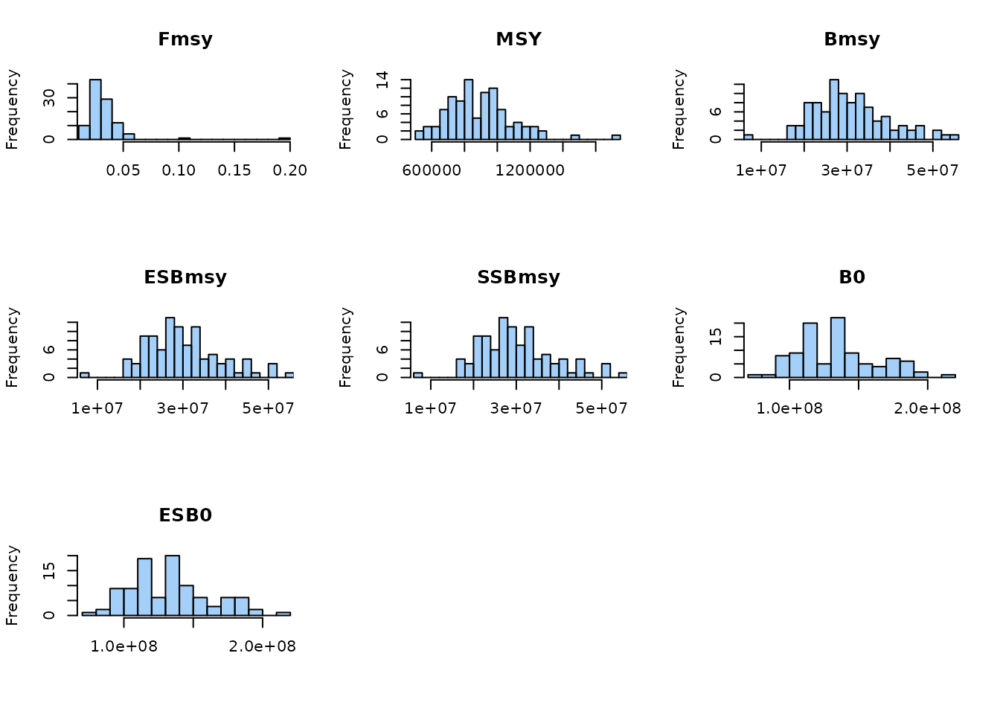
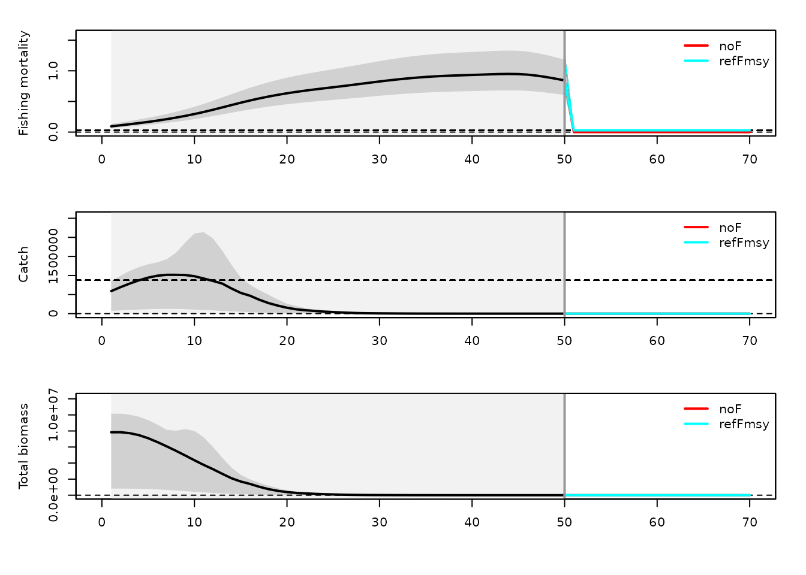
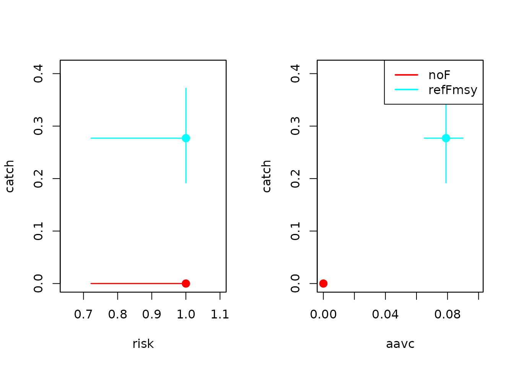

# MSE with iamse

## Introduction

The **iamse** package provides a framework for intra-annual, age-based
operating models for management strategy evaluation (MSE). This vignette
walks through a simple demo:

1.  Load example life history information
2.  Define simulation and noise settings
3.  Estimate stochastic reference points
4.  Define and run harvest control rules (HCRs)
5.  Inspect results and basic trade-offs

The example uses small settings (few years and replicates) to keep
runtime reasonable.

## Loading the package and example data

``` r
library(iamse)

## Load example life history information
data("stocklist")

## Check the main life history table
head(stocklist$mlh)
## $X
## [1] 35
## 
## $stock
## [1] 35
## 
## $stockID
## [1] pol-89a
## 50 Levels:  nep-2627  wit-nsea ang-78ab ang-ivvi arg-comb-exVa ... whg-scow
## 
## $group
## [1] Demersal
## Levels: Deep Demersal Pelagic Shellfish
## 
## $a
## [1] 1e-05
## 
## $b
## [1] 3
```

We start from the built-in multi-species life-history table
`stocklist$mlh`. For this demo, we add a simple assumption about length
variation and then prepare the data with
[`check.dat()`](https://tokami.github.io/iamse/reference/check.dat.md).

``` r
dat0 <- stocklist$mlh

## Assume a coefficient of variation in length
dat0$CVlen <- 0.1

## Check and prepare data for iamse
dat <- check.dat(dat0)
## Length-weight coefficient for catch weight-at-age missing: dat$lwaF. Setting dat$lwaF equal to stock length-weight coefficient: dat$lwa
## Length-weight exponent for catch weight-at-age missing: dat$lwbF. Setting dat$lwbF equal to stock length-weight exponent: dat$lwb
## Length at 50% selectivity missing: dat$Ls50. Setting dat$Ls50 equal to maturity parameter: dat$Lm50.
## Length at 95% selectivity missing: dat$Ls95. Setting dat$Ls95 equal to maturity parameter: dat$Lm95.
## No natural mortality at age provided. Setting M-at-age based on the Gislason's (2010) empirical formula.
str(dat, 1)
## List of 110
##  $ X                     : int 35
##  $ stock                 : int 35
##  $ stockID               : Factor w/ 50 levels " nep-2627"," wit-nsea",..: 36
##  $ group                 : Factor w/ 4 levels "Deep","Demersal",..: 2
##  $ a                     : num 1e-05
##  $ b                     : num 3
##  $ a50                   : num 3.84
##  $ a0                    : num -0.1
##  $ K                     : num 0.19
##  $ Linf                  : num 85.6
##  $ Fmsy                  : num 0.159
##  $ M                     : num [1:50, 1] 0.282 0.282 0.282 0.282 0.282 0.282 0.282 0.282 0.282 0.282 ...
##  $ M2                    : num 0.282
##  $ phiL                  : num 3.14
##  $ MK                    : num 1.8
##  $ ta                    : num 0.368
##  $ L50                   : num 45.1
##  $ wqs                   : num 9.03
##  $ L50Linf               : num 0.527
##  $ L50_2                 : num 21.4
##  $ wqs_2                 : num 4.28
##  $ Lmat                  : num 21.4
##  $ wmat                  : num 4.28
##  $ F1                    : num 0.0954
##  $ F2                    : num 0.159
##  $ F3                    : num 0.223
##  $ Fmax                  : logi NA
##  $ F01                   : logi NA
##  $ F05                   : logi NA
##  $ F1est                 : logi NA
##  $ F2est                 : logi NA
##  $ F3est                 : logi NA
##  $ rmax                  : num 7e+05
##  $ beta                  : num 0.71
##  $ numSamp               : int 1620
##  $ binSize               : num 1.5
##  $ MA                    : int 9
##  $ Kcv                   : num 0.1
##  $ Linfcv                : num 0.1
##  $ srrcv                 : num 0.1
##  $ k                     : num 0.19
##  $ linf                  : num 85.6
##  $ lwa                   : num 1e-05
##  $ lwb                   : num 3
##  $ binwidth              : num 2
##  $ CVlen                 : num 0.1
##  $ ny                    : num 50
##  $ logR0                 : num 13.8
##  $ pzbm                  : num 0
##  $ q                     : num 0.005
##  $ Lm50                  : num 41
##  $ Lm95                  : num 52
##  $ specEng               : chr "Pollack"
##  $ specLat               : chr "Pollachius pollachius"
##  $ fam                   : chr "Gadidae"
##  $ h                     : num 0.79
##  $ amax                  : num 8
##  $ L95                   : num 57.2
##  $ mk                    : num 1.48
##  $ fmax05                : num 1.68
##  $ fmax10                : num 0.526
##  $ fmax15                : num 0.238
##  $ fmax10de              : num 0.725
##  $ fmax10in              : num 0.413
##  $ fixProcs              : logi FALSE
##  $ ns                    : num 1
##  $ asmax                 : num 9
##  $ ages                  : num [1:9, 1] 0.5 1.5 2.5 3.5 4.5 5.5 6.5 7.5 8.5
##  $ yvec                  : int [1:50] 1 2 3 4 5 6 7 8 9 10 ...
##  $ svec                  : int [1:50] 1 1 1 1 1 1 1 1 1 1 ...
##  $ s1vec                 : num [1:50] 1 2 3 4 5 6 7 8 9 10 ...
##  $ s1avec                : num [1:9] 1 2 3 4 5 6 7 8 9
##  $ as2a                  : int [1:9] 1 2 3 4 5 6 7 8 9
##  $ as2s                  : int [1:9] 1 1 1 1 1 1 1 1 1
##  $ t0                    : num -0.1
##  $ LA                    : num [1:9] 9.22 22.44 33.37 42.41 49.88 ...
##  $ mids                  : num [1:51] 1 3 5 7 9 11 13 15 17 19 ...
##  $ plba                  : num [1:9, 1:51] 2.41e-15 4.17e-20 2.70e-21 7.91e-22 3.96e-22 ...
##  $ pabl                  : num [1:51, 1:9] 1 1 1 1 1 ...
##  $ weight                : num [1:9] 0.00784 0.11298 0.37154 0.76261 1.24109 ...
##  $ lwaF                  : num 1e-05
##  $ lwbF                  : num 3
##  $ weightF               : num [1:9] 0.00784 0.11298 0.37154 0.76261 1.24109 ...
##  $ mat                   : num [1:9] 0.000209 0.008293 0.144593 0.573969 0.861655 ...
##  $ sel                   :List of 1
##  $ fecun                 : num 1
##  $ Msel                  :List of 1
##  $ FM                    : num [1:50, 1] 0.1 0.118 0.137 0.157 0.177 ...
##  $ depl                  : num 0.5
##  $ depl.quant            : chr "B0"
##  $ initN                 : num [1:9] 0 0 0 0 0 0 0 0 0
##  $ initF                 : num 0.2
##  $ SR                    : chr "bevholt"
##  $ R0                    : num 1e+06
##  $ bp                    : num 0
##  $ recBeta               : num 0
##  $ recGamma              : num 0
##  $ recAlpha              : num 0
##  $ spawning              : num 1
##   [list output truncated]
```

## Simulation settings

Next we define the simulation settings with
[`check.set()`](https://tokami.github.io/iamse/reference/check.set.md).
For the vignette we use a small number of projection years and
replicates.

``` r
set <- check.set()

## Number of projection years
set$nysim <- 20

## Number of stochastic replicates (kept small for demonstration)
set$nrep <- 10

## Use the median across replicates as reference method
set$refMethod <- "median"
```

### Noise structure

We now specify variation in life history, process, and observation
components. Each entry is given as a three-element vector and
interpreted inside **iamse**.

``` r
## Between-replicate variation (life-history parameters)
set$noise$rep$H  <- c(0.1, 0, 1)
set$noise$rep$M  <- c(0.1, 0, 1)
set$noise$rep$R0 <- c(0.1, 0, 1)

## Process noise (recruitment and fishing mortality)
set$noise$time$R <- c(0.7, 0.4, 1)   ## species-specific recruitment variability
set$noise$rep$F  <- c(0.15, 0, 1)

## Observation noise (indices and catches)
set$noise$time$I <- c(0.3, 0, 1)
set$noise$time$C <- c(0.1, 0, 1)
```

## Stochastic reference points

Before running the MSE, we estimate stochastic reference points for each
stock. To keep computation time down, we reduce the number of replicates
used for the reference calculation.

``` r
## Lower number of replicates to speed up reference-point estimation
set$refN <- 100

## Estimate stochastic reference levels
dat <- est.ref.levels.stochastic(
  dat, set,
  fmax = 5,
  ncores = 2,
  plot = TRUE
)

## Add Blim as a fraction of pristine biomass
dat$ref$Blim <- 0.2 * dat$ref$B0

str(dat$ref, 1)
## 'data.frame':    50 obs. of  8 variables:
##  $ Fmsy  : num  0.0292 0.0292 0.0292 0.0292 0.0292 ...
##  $ MSY   : num  876638 876638 876638 876638 876638 ...
##  $ Bmsy  : num  29260984 29260984 29260984 29260984 29260984 ...
##  $ ESBmsy: num  28644975 28644975 28644975 28644975 28644975 ...
##  $ SSBmsy: num  28644975 28644975 28644975 28644975 28644975 ...
##  $ B0    : num  1.34e+08 1.34e+08 1.34e+08 1.34e+08 1.34e+08 ...
##  $ ESB0  : num  1.33e+08 1.33e+08 1.33e+08 1.33e+08 1.33e+08 ...
##  $ Blim  : num  26795844 26795844 26795844 26795844 26795844 ...
```



## Defining harvest control rules

We now define a few simple HCRs:

- `"noF"`: no fishing
- `"refFmsy"`: fishing at the true $F_{\text{MSY}}$

``` r
## Baseline HCRs

## No fishing ("noF")
iamse::def.hcr.ref(set. = set)

## Fishing at true Fmsy ("refFmsy")
iamse::def.hcr.ref(consF = "fmsy", set. = set)

## Select HCRs to evaluate
set$hcr <- c(
  "noF",
  "refFmsy"
)

set$hcr
## [1] "noF"     "refFmsy"
```

## Running the MSE

With data, settings, reference points, and HCRs defined, we can run the
MSE. For the vignette we keep `ncores = 1` to avoid parallelization
issues on some systems.

``` r
resMSE <- run.mse(
  dat, set,
  ncores  = 1,
  verbose = TRUE
)
## No M provided for projection period. Using M in the last historical year for the projection period.
## Running replicate: 1
## Running replicate: 2
## Running replicate: 3
## Running replicate: 4
## Running replicate: 5
## Running replicate: 6
## Running replicate: 7
## Running replicate: 8
## Running replicate: 9
## Running replicate: 10

## Structure of results: first by HCR, then by replicate
names(resMSE)
## [1] "noF"     "refFmsy"
names(resMSE[[1]])
##  [1] "1"  "2"  "3"  "4"  "5"  "6"  "7"  "8"  "9"  "10"
```

Each element of `resMSE[[hcr]][[rep]]` contains the full output of the
operating model for that HCR and replicate.

``` r
## Inspect the structure for the first HCR and first replicate
str(resMSE[[1]][[1]], 1)
## List of 17
##  $ lastNAA : num [1:9] 0.00 6.26e-04 3.92e-04 5.46e-05 2.94e-04 ...
##  $ lastFAA : num [1:9] 0 0 0 0 0 0 0 0 0
##  $ TSB     : num [1:70, 1] 1417269 1417224 1381092 1308735 1213473 ...
##  $ TSBfinal: num [1:70] 1416236 1416832 1380491 1306829 1212057 ...
##  $ SSBfinal: num [1:70] 1332718 1332684 1301905 1242601 1145066 ...
##  $ ESBfinal: num [1:70] 1332718 1332684 1301905 1242601 1145066 ...
##  $ TACprev : num 0
##  $ ESB     : num [1:70, 1] 1332718 1332684 1301905 1242601 1145066 ...
##  $ SSB     : num [1:70, 1] 1332718 1332684 1301905 1242601 1145066 ...
##  $ rec     : num [1:70, 1] 131684 50043 76654 243043 180494 ...
##  $ FM      : num [1:70, 1] 0.138 0.163 0.189 0.216 0.245 ...
##  $ CW      : num [1:70, 1] 170827 199613 223106 240295 247488 ...
##  $ TACs    : num [1:70] NA NA NA NA NA NA NA NA NA NA ...
##  $ tacs    :'data.frame':    20 obs. of  41 variables:
##  $ errs    :List of 2
##  $ obs     :List of 16
##  $ refs    :'data.frame':    70 obs. of  8 variables:

## For example, TAC time series for a given HCR and replicate
resMSE[[2]][[4]]$tacs$TAC
##  [1] 2.541212 2.970311 3.359846 3.680052 3.953962 4.203114 4.376928 4.546574
##  [9] 4.766689 5.084030 5.460990 5.832155 6.166623 6.442102 6.646017 6.804722
## [17] 6.889231 7.033127 7.295095 7.636179
```

## Time series plots

The package provides helper plotting functions to visualize the
evolution of fishing mortality, catch, and biomass over time for the
different HCRs.

``` r
par(mfrow = c(3, 1), mar = c(4, 4, 1, 1), oma = c(1, 1, 1, 1))

plotiamse.f(dat, set, resMSE)
## Warning in max(which(dat$FM == 0)): no non-missing arguments to max; returning
## -Inf
plotiamse.cw(dat, set, resMSE)
## Warning in max(which(dat$FM == 0)): no non-missing arguments to max; returning
## -Inf
plotiamse.b(dat, set, resMSE)
## Warning in max(which(dat$FM == 0)): no non-missing arguments to max; returning
## -Inf
```



These plots show how the different management strategies affect the
trajectory of the stock and fishery.

## Trade-offs between performance metrics

Finally, we can summarize MSE results using standard performance metrics
such as:

- Long-term catch
- Risk (e.g. probability of dropping below a biomass limit)
- Interannual catch variability (AAV of catch)

``` r
mets <- est.metrics(
  resMSE, dat, set,
  mets = c("catch", "risk", "aavc")
)
## [1] "noF"
## [1] "refFmsy"

head(mets)
## $noF
##        loCI mu upCI se   n
## catch 0.000  0    0  0 200
## risk  0.722  1    1  0  10
## aavc  0.000  0    0 NA  10
## 
## $refFmsy
##        loCI    mu  upCI    se   n
## catch 0.192 0.277 0.372 0.114 200
## risk  0.722 1.000 1.000 0.000  10
## aavc  0.065 0.079 0.090 0.006  10
```

We can then visualize trade-offs between pairs of metrics using
[`plotiamse.tradeoff()`](https://tokami.github.io/iamse/reference/plotiamse.tradeoff.md).

``` r
par(mfrow = c(1, 2))

## Catch vs risk
plotiamse.tradeoff(
    mets, c("catch", "risk"),
    plot.legend = FALSE
)

## Catch vs interannual variability (AAVC)
plotiamse.tradeoff(
    mets, c("catch", "aavc")
)
```



These trade-off plots provide a compact way to compare HCRs in terms of
yield, conservation risk, and stability — one of the key strengths of
management strategy evaluation.

## Summary

This vignette showed a minimal workflow with **iamse**:

1.  Prepare life-history data and simulation settings
2.  Specify noise and estimate stochastic reference points
3.  Define and select harvest control rules
4.  Run the MSE and inspect outputs
5.  Summarize and visualize performance trade-offs

You can build on this template by:

- Changing life-history parameters
- Adding more complex noise structures
- Defining additional HCRs
- Increasing the number of years and replicates for more realistic
  applications.
